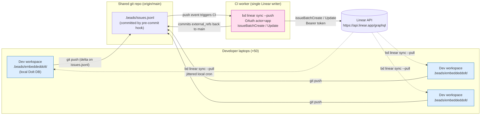

# beads-to-linear — Architecture & Execution Plan

**Date:** 2026-05-01
**Source upstream:** `gastownhall/beads` @ commit `e19e31c191827c577437c4ab4a9946fa305c4d24` (`bd` v1.0.3)
**Investigation method:** Two-phase deep-dive review with 6 parallel specialist agents + cross-pollination round
**Persisted artifacts:** `.review/cluster-{a,b,cd,e,f,f2}.md` + `.review/phase2-simplicity-attack.md`

---

## 1. Executive Summary

- **Recommended architecture: per-laptop reads + central writer via a git-mediated CI worker** (Option 7 in the architecture report; called "Option 3 hardened" by the simplicity reviewer — they converged independently). Devs run `bd linear sync --pull` locally on a jittered cron; a single CI job is the sole writer to Linear, triggered by git push events that carry `.beads/issues.jsonl` deltas. This eliminates the top three failure modes (conflict thrash, duplicate creation, rate-limit storms on the write path) without requiring webhooks (charter-forbidden), federation (wisp leakage), or per-laptop write credentials (P0 security).
- **The plan is gated on three upstream PRs to `gastownhall/beads`** that are unambiguously charter-compatible: (1) refuse to write `linear.api_key` to git-tracked `config.yaml` (P0 security), (2) OAuth client-credentials support in `internal/linear/client.go` (unblocks single-credential service identity), (3) `issueBatchCreate`/`issueBatchUpdate` adoption (50× write efficiency). Without (2), no centralized architecture has a clean credential story. Without (1), no per-laptop pull credential is safe.
- **Top three risks:** (a) `bd config set linear.api_key` writes a personal Linear key into a git-tracked file by default — verified directly in source, P0; (b) the existing federation primitive does not honor the wisp/ephemeral filter, so any federation-based topology amplifies private-data exposure across all 50 devs; (c) the Integration Charter (`docs/INTEGRATION_CHARTER.md`, decision-logged 2026-03-24) rejects webhooks and cross-tracker orchestration, foreclosing several otherwise-attractive architectures and constraining all sync to polled mode.
- **Upstream vs. org-internal split:** All charter-compatible improvements (OAuth, batch mutations, idempotency keys, federation privacy filter, refused-secret-write, rate-limit header parsing, type-mapping completion) go upstream as discrete PRs. The CI worker, deployment scripts, monitoring, runbooks, and config templates stay in this org-internal repo.
- **Rollout shape:** Three phases — preparation behind the upstream PRs, narrow pilot on one team with single-direction sync, then broadened bidirectional sync once OAuth lands. Jira → Linear backfill happens via Linear's native importer first, then beads is brought online against the resulting Linear state, never the reverse.

---

## 1a. What We're Building (by Persona)

### For developers (day-to-day)

Nothing changes about how you work locally. You still use `bd create`, `bd update`, `bd close`, `bd list` exactly like today. Your local `.beads/` database is still yours, still works offline, still powers your agents.

Two new things happen automatically:

1. **Your beads show up in Linear.** When you `git push`, your project's `.beads/issues.jsonl` file goes with it (this already happens via the pre-commit hook). A CI job notices the push, reads the JSONL, and creates/updates the corresponding Linear issues. You never talk to Linear directly on the write path.

2. **Linear updates trickle back to your laptop.** A background cron runs `bd linear sync --pull` every 15 minutes. If your PM changes a priority in Linear, or a teammate closes something in Linear's UI, you see it locally within 15 minutes. No action needed — it just appears in `bd list`.

**Setup per dev:** Export `LINEAR_API_KEY` in your shell profile (you generate this once in Linear's settings). Run an install script. Done.

**What you don't do:** You never run `bd linear sync --push`. You never log into Linear to create issues. You never configure team IDs or mappings. You just use beads like always, and Linear stays in sync.

### For product managers

Linear becomes your single pane of glass — and it's always current without anyone doing manual data entry.

You work in Linear like normal: triaging the backlog, setting priorities, adjusting statuses, writing comments, building roadmap views. The difference is that your board is being fed by real engineering work happening in beads, not by devs remembering to update a ticket.

**What you see:** Issues appearing in Linear that correspond to what devs are actually working on. Statuses that reflect reality — when a dev closes a bead locally, the corresponding Linear issue moves to "Done" on the next CI run (within minutes of their push). When a dev creates a new task, it shows up in Linear without anyone asking them to file a ticket.

**What you can do:** Change priorities in Linear, add labels, update statuses, reassign — and **create new issues directly in Linear**. Those changes flow back to devs' laptops on the 15-minute pull cycle. If you mark something as urgent in Linear, the dev sees it locally in their `bd list` output within 15 minutes. If you create a new issue in Linear, it appears as a local bead in every dev's workspace on the next pull. You don't need to ask a dev to "file a ticket in beads" — just create it in Linear and it flows down.

**What you don't have to do:** Chase devs to update tickets. Run "ticket hygiene" meetings. Wonder if the board reflects reality. The board IS reality because it's fed by the same tool devs use to do their actual work.

**What happens when something disappears:** If a dev deletes a bead or converts it to a private "wisp," the corresponding Linear issue is **archived** (not deleted). It moves out of your active board views but is recoverable if needed. You'll never see a ticket silently go stale — it either stays current or gets cleanly archived.

**One caveat to understand:** Not everything a dev tracks locally shows up in Linear. Devs have "wisps" — throwaway scratch notes and draft thoughts that are intentionally private. Only real work items (tasks, bugs, features, stories, epics) make it to Linear. This means your Linear board isn't cluttered with every half-formed thought a dev had at 2am.

### For repo owners and eng ops

You maintain one CI workflow per repo that has beads. It's a GitHub Actions (or equivalent) YAML file that:

- Triggers on pushes to `main` that touch `.beads/issues.jsonl`
- Runs `bd linear sync --push` using a single OAuth credential stored in CI secrets
- Commits the resulting `external_ref` links back to `main` (so other devs know which bead maps to which Linear issue)
- Archives a JSON log of what it synced

You own the OAuth credential. One app registered in Linear, one client_id + client_secret pair, stored in your CI system's secrets. When someone leaves the org, nothing changes — individual devs' personal read-only keys are their own; the write credential is org-owned.

You decide which teams opt in. A team opts in by adding the CI workflow to their repo and having their devs run the cron installer. Teams that don't opt in are unaffected.

Monitoring: CI failures surface through your existing CI alerting. The sync produces structured logs. If something goes wrong, the runbook covers recovery (including "we synced bad data — here's how to revert").

### For the project lead (Kevin)

Three hats:

1. **Upstream contributor to gastownhall/beads.** File ~9 PRs that make `bd linear` better for everyone — security fix (stop writing API keys to git-tracked files), OAuth support, batch mutations, idempotency, rate-limit handling. These are independently valuable contributions. The canary PR (type mapping) goes first to build reviewer trust.

2. **Architect of the org rollout.** Own `beads-to-linear` as the planning workspace and the home for org-specific tooling (CI workflow template, cron installer, runbook, backfill script). This is a thin layer — most of the heavy lifting is in beads itself.

3. **Pilot lead.** Prove this out with your own team first using the sandbox Linear workspace (`linear.app/kevglynn`). Once it's solid, hand the pattern to other teams as opt-in. The ai-dev-playbook can eventually consume the proven patterns (e.g., `playbook-init.sh --linear` installs the cron and validates credentials).

### In lay terms

**Today:** Devs track their work in beads on their laptops. Management can't see it unless they look over a dev's shoulder. Jira exists but nobody likes it.

**After this ships:** Devs keep using beads exactly like before. But now, every time they push code, their beads automatically appear in Linear — the tool management actually wants to use. Management gets their dashboards, priorities, and status views in Linear. Devs never have to open Linear or do double-entry. One robot (the CI worker) is the only thing that talks to Linear's write API, so there's no chaos from 50 people syncing at once.

**The analogy:** It's like how your email client syncs to Gmail's servers. You write emails in your client (beads). Gmail (Linear) is where everyone else sees them. There's a sync process in the background. You don't think about it.

---

## 2. Current State (Verified)

All claims below were verified by direct reading of `gastownhall/beads` source via `/Users/kevinglynn/beads/` (local clone) and the GitHub API. Specific file/line references are anchored against commit `e19e31c191827c577437c4ab4a9946fa305c4d24`.

### 2.1 What `bd linear` does today

| Capability | Implementation | Source |
|---|---|---|
| Bidirectional polled sync | `bd linear sync` with `--pull`/`--push`/(default both) | `cmd/bd/linear.go` |
| Conflict resolution | Issue-level (not field-level); newer-wall-clock wins by default; `--prefer-local`/`--prefer-linear` overrides | `internal/tracker/engine.go:1043-1066` |
| External ref storage | `external_ref` field on `types.Issue`, holds canonical Linear URL `https://linear.app/<team>/issue/<IDENT>` | `internal/linear/client.go:709` (`CanonicalizeLinearExternalRef`) |
| Multi-team | `linear.team_ids` (CSV); push requires explicit `--team` when multi-team configured | `internal/linear/tracker.go:33-55` |
| Type filtering | `--type`, `--exclude-type`, `--include-ephemeral`, `--parent <ticket>` (subtree) | `cmd/bd/linear.go` flags + `internal/tracker/engine.go:1295-1325` |
| Mappings | `linear.priority_map.*`, `linear.state_map.*`, `linear.label_type_map.*`, `linear.relation_map.*` | `internal/linear/mapping.go` |
| ID mode | `linear.id_mode = hash` (default), `linear.hash_length = 6` (configurable 3–8); SHA-256 truncated, base36 | `internal/linear/mapping.go` (`GenerateIssueIDs`) |
| Pagination | Cursor-based, `MaxPageSize = 100`, `MaxPages = 1000` safety limit | `internal/linear/types.go:30-40` |
| Rate limit handling | Per-request retry on HTTP 429; exponential backoff `1s × 2^attempt` + random jitter; `MaxRetries = 3` | `internal/linear/client.go:163-197` |
| Pull granularity | Bulk via `FetchIssues` / `FetchIssuesSince` (incremental from `linear.last_sync`) | `internal/linear/client.go:228, 315` |
| Push granularity | Per-issue `issueCreate` and `issueUpdate` mutations | `internal/linear/client.go:447, 519` |
| Storage | Embedded Dolt SQL DB at `.beads/embeddeddolt/` (gitignored); `bd vc commit/merge/branch/diff/history` | `internal/storage/dolt/*` |
| Federation | Peer-to-peer Dolt remote sync, `bd federation sync --strategy ours\|theirs` | `internal/storage/dolt/federation.go` |
| Interchange | `bd export` writes `.beads/issues.jsonl`; pre-commit hook auto-exports | `cmd/bd/hooks.go`, `.githooks/pre-commit` |
| Last-sync timestamp | `linear.last_sync` stored in local metadata only; **does not survive `bd dolt push/pull` or fresh clone** | `cmd/bd/linear.go` (`SetLocalMetadata`) |

### 2.2 What `bd linear` does NOT do today (verified by absence)

| Missing capability | Confirmed by | Impact |
|---|---|---|
| Inbound webhooks | No webhook handler in codebase; `cmd/bd/linear.go` has no receiver; charter-forbidden upstream | All sync is polled |
| Batch mutations | No use of `issueBatchCreate` / `issueBatchUpdate`; one mutation per issue | 50× rate-limit overhead on push |
| OAuth client-credentials | `internal/linear/client.go:107` only accepts API key string; sends `Authorization: <key>` (personal-key format) | No service identity, no `actor=app`, no dynamic rate limits |
| Idempotency keys | `CreateIssue` mutation in `client.go:447` carries no idempotency tag | Sync interruption between create + external_ref update produces Linear duplicates |
| Sync-level locking | No mutex, no advisory lock, no transaction wrapping the full sync | Two concurrent `bd linear sync` invocations race |
| Persistent sync log | `SyncResult` printed to stdout, not persisted; no sync history table | Cannot reconstruct what a past sync did |
| Push of parent/relations/type/labels/comments | Skipped test `TestLinearRoundTripRelationships` references upstream issue #3187 | Push only sends title/description/priority/stateId |
| Federation type/ephemeral filter | `internal/storage/dolt/federation.go` syncs full DB; filter is in `engine.go`, not federation | **Wisps leak to federation peers** (privacy boundary violation) |
| `Retry-After` header parsing | `client.go:163-197` uses fixed exponential backoff; ignores rate-limit headers | Thundering-herd retry amplification |

### 2.3 Linear API surface (verified via Linear developer docs)

| Property | Value | Source |
|---|---|---|
| Endpoint | `https://api.linear.app/graphql` (GraphQL only, no REST) | Linear docs |
| Personal API key rate limit | 2,500 requests/hour, 3,000,000 complexity/hour, scoped to user | Linear rate-limit docs |
| OAuth app rate limit | 5,000 requests/hour, 2,000,000 complexity/hour, scoped to user/app, **dynamic scaling on `actor=app` based on workspace paid-user count** | Linear OAuth + actor docs |
| Algorithm | Leaky bucket | Linear rate-limit docs |
| `issueBatchCreate` | Up to **50 issues per call**, 1 request against rate limit | Linear schema |
| `issueBatchUpdate` | Multiple issues with shared `IssueUpdateInput`, 1 request | Linear schema |
| Pagination | Relay cursor-based; default 50/page, max 250/page | Linear pagination docs |
| Webhook delivery | At-least-once; no ordering guarantee; 5-second timeout; max 3 retries (1m / 1h / 6h); auto-disable on persistent failure; **no backfill** | Linear webhook docs |
| Auth (personal) | `Authorization: lin_api_xxxxx` (no Bearer prefix); no expiration | Linear auth docs |
| Auth (OAuth client-credentials) | `Authorization: Bearer <token>`; 30-day TTL; no refresh token (re-fetch on 401); one active token per app | Linear OAuth docs |

### 2.4 Storage / config behavior (verified)

| Fact | Source |
|---|---|
| `linear.api_key` is in the `YamlOnlyKeys` map — written to `config.yaml`, not Dolt DB | `internal/config/yaml_config.go:71-76` (with comment: "Secrets: tokens and API keys must NOT be stored in the Dolt database because that data is pushed to remotes, triggering secret-scanning blocks on GitHub. Store them in local config.yaml instead.") |
| `.beads/config.yaml` IS git-tracked | `.beads/.gitignore` lines 70-73: "Config files (metadata.json, config.yaml) are tracked by git by default since no pattern above ignores them" |
| Default template documentation is **stale** — says these keys are "stored in the database, not in this file" | `cmd/bd/init_templates.go:79-82` (does not match the 2026 yaml-only behavior) |
| Documented setup leads with `bd config set linear.api_key`, not env var | `examples/linear-workflow/README.md:26`, `docs/CONFIG.md:645` |

### 2.5 Project context

| Fact | Source |
|---|---|
| Maintainer (primary): `maphew` — 23 of last 50 commits, charter author, primary reviewer | `gh api repos/gastownhall/beads/commits` |
| Maintainer (storage/concurrency): `coffeegoddd` — 11 of last 50 commits | same |
| Owner of this initiative: `kevglynn` — already a contributor (6 of last 50 commits) | same |
| Integration Charter explicit decisions: "no webhooks, ever"; "no cross-tracker orchestration"; "no attachment / binary content sync"; "no full comment / thread mirroring"; "no credential vault / multi-platform token aggregation"; "no UI parity features" | `docs/INTEGRATION_CHARTER.md` decision log dated 2026-03-24 |
| Test bar: integration tests must use mocked HTTP (no live API in CI); race detection required for sync changes; `make test-upgrade` and `make test-regression` gate releases | `CONTRIBUTING.md`, `cmd/bd/linear_roundtrip_test.go` |

---

## 3. Gaps & Failure Modes

Each row carries severity, who it hurts, and verified evidence.

| # | Gap / Failure mode | Severity | Who it hurts | Evidence |
|---|---|---|---|---|
| 1 | **Linear API key leaks to git-committed `.beads/config.yaml`** | **P0** | All devs running documented setup; org credentials | `internal/config/yaml_config.go:71-76` + `.beads/.gitignore` lines 70-73 |
| 2 | Stale template documentation tells users keys live in DB (false since 2026 fix) | **P0** | New users following the template | `cmd/bd/init_templates.go:79-82` |
| 3 | **Federation does not honor wisp / ephemeral filters** — wisps leak across all federation peers | **P1** | Any architecture using federation for multi-dev coordination | `internal/storage/dolt/federation.go` (no type/ephemeral filter); filter logic only in `internal/tracker/engine.go:1295-1325` |
| 4 | OAuth client-credentials not implemented | **P1** | Org rollout (no service identity, no dynamic rate scaling, every credential is a personal key) | `internal/linear/client.go:107` only handles string API key with non-Bearer Authorization |
| 5 | `issueBatchCreate` / `issueBatchUpdate` not used | **P1** | Push throughput; cold-start sync; rate-limit headroom | Search of `internal/linear/client.go` confirms only `issueCreate`/`issueUpdate` are referenced |
| 6 | Idempotent create not implemented | **P1** | Multi-dev create paths (duplicate Linear issues) | `client.go:447` `CreateIssue` mutation has no idempotency-key argument; no pre-create dedup query |
| 7 | Conflict resolution is wall-clock-newer-wins across machine clock domains | **P1** | Any bidirectional multi-writer scenario; silent overwrite of edits at 50 devs | `internal/tracker/engine.go:1043-1066` compares `LocalUpdated.After(ExternalUpdated)`; NTP skew between laptops is undefined |
| 8 | No `Retry-After` header parsing; thundering-herd retry amplification | **P1** | Any sync hitting rate limits; existing GitHub-sync issue #3623 already shows symptom | `client.go:163-197` uses fixed `RetryDelay * 2^attempt` regardless of server hint |
| 9 | Sync interruption between create + `external_ref` update creates duplicate next run | **P1** | Push reliability under any failure | `engine.go` doPush sequences create then update-external-ref non-atomically |
| 10 | Push does not send parent / relations / type / labels / comments | P2 | Any team relying on Linear-side hierarchy | `TestLinearRoundTripRelationships` in `linear_roundtrip_test.go` is `t.Skip()`-ped, references upstream #3187 |
| 11 | `linear.last_sync` stored in local metadata only; lost on `bd dolt pull` or fresh clone | P2 | Cross-machine continuity; new dev onboarding | Comment in `cmd/bd/linear.go` confirms `SetLocalMetadata`, not Dolt-table-stored |
| 12 | No persistent sync log / audit history of cross-boundary writes | P2 | Forensics, blame, recovery | Absence of any sync-history table in storage schema |
| 13 | No bulk-undo or rollback tooling for "we synced 50,000 bad updates" | P2 | Recovery story | Verified absence in `cmd/bd/linear*` |
| 14 | Type mapping incomplete (decision, spike, story, milestone) | P3 | Teams using full beads type system | GH#3604 |
| 15 | Sync engine does not implement `tracker.BatchPushTracker` interface (it exists but Linear `Tracker` doesn't satisfy it) | P3 | Push performance | `internal/tracker/types.go:62-65` defines interface; `internal/linear/tracker.go` doesn't implement |

The P0 / P1 set drives the upstream PR plan in §6.

---

## 4. Architecture Options Evaluated

Six options were modelled in Phase 1; Phase 2 cross-pollination eliminated three on grounds of charter incompatibility, structural credential leak, or wisp amplification through federation. A seventh option emerged from convergence between two independent specialists.

| Dim | 1. Per-laptop hardened | 2. Central reconciler | 3. Git-mediated queue | 4. Federation bridge | 5. Linear-first read-only | 6. Webhook hybrid | 7. Per-laptop pulls + central writer (CI) |
|---|---|---|---|---|---|---|---|
| Writers to Linear (steady) | 50 concurrent | 1 (long-lived service) | 1 (CI job) | 1 (bridge process) | 0 (drafts only) | 1 (worker) | 1 (CI job) |
| Conflict surface | All 9 failure modes active | B/D eliminated; reconciler still has merge logic for 50 sources | B/C/D/H eliminated by git ordering | Eliminated for Linear hop, **relocated to bridge's federation merge** | B/H eliminated; C still possible from create-only | B/D/H eliminated on push; pull conflicts remain | B/C/D/H eliminated by git ordering on push; pull conflicts isolated per-laptop |
| Privacy enforcement | Per-dev (fragile) | Centralized at reconciler | Centralized at `bd export` time | **BROKEN — federation aggregates wisps from all 50 devs** | N/A (no push) | Centralized at worker | **Centralized at `bd export` (filters apply before git sees data)** |
| New infrastructure | None | Service VM, Dolt-remote-accessible from 50 laptops | CI worker (existing infra) | Bridge VM, Dolt remote endpoint network-accessible from 50 laptops | None | Worker + webhook receiver endpoint | CI worker (existing infra) |
| Charter compatibility | High (just hardening) | Low (org-specific service infra; not upstreamable) | High (CI is org-internal infra; sync improvements upstream) | **Dead — charter forbids cross-tracker orchestration; bridge pattern is exactly that** | High (policy only) | **Dead — charter forbids webhooks** | High (CI is org-internal; sync improvements upstream) |
| Day-2 ops | 50 independent processes to monitor | 1 service + HA + Dolt-remote networking | CI job logs (existing) | 1 bridge + 50 federation peers + Dolt remote networking | None | Worker + webhook endpoint + echo suppression | CI job logs (existing) + 50 jittered local pulls |
| Latency dev → Linear | ~1 cron interval | ~1 reconciler interval | ~1 git push + CI run | ~1 federation cycle + 1 Linear sync cycle | N/A | Sub-second on push, polled on pull | ~1 git push + CI run |
| Upstream contribution generated | High (idempotency, rate-limit, jitter — all charter-compatible) | Zero (org-specific) | Two PRs surfaced naturally (OAuth, batch mutations) | Zero — bridge pattern is non-upstreamable | Zero | Zero — webhooks rejected | Two PRs surfaced naturally (OAuth, batch mutations) plus security/privacy fixes |
| Credential blast radius | 50 personal keys (P0 leak by default) | 1 service credential | 1 service credential in CI secrets | 1 service credential in bridge | N/A | 1 worker credential | 1 service credential in CI + 50 read-mostly per-dev keys |

### Narrative — Option 1 (Per-laptop hardened)

Each developer continues to run `bd linear sync` locally, with hardening: jittered cron, idempotency keys on creates, per-issue Dolt transactions, label-based privacy filters, rate-limit-header-aware backoff. The architecture is operationally trivial — there is no new infrastructure, every improvement goes upstream as a `bd` patch, failure isolation is excellent (one dev's failure does not affect the others), and the read path is embarrassingly parallel. The upstream contribution shape is also the largest of any option. The reasons it cannot be the recommended target architecture for 50 devs are structural: (a) wall-clock conflict resolution across machine clock domains makes silent overwrite on shared issues a routine event, not a corner case; (b) the documented setup writes a per-developer Linear API key into a git-tracked file, which produces 50 leaked credentials at default rollout; (c) monitoring 50 independent sync processes converges to "monitor nothing" in practice. Hardened Option 1 remains correct for small teams (≤15 devs, low-contention workspaces) and is the right *transitional* posture during pilot, but does not scale to the org target.

### Narrative — Option 2 (Central reconciler)

A long-lived process per org pulls from each developer's Dolt database (via Dolt SQL-server remotes or git-cloned working copies), reconciles into a canonical state, and writes to Linear as the only API client. It eliminates the most dangerous failure modes on the Linear side (one writer means no conflict thrash, no duplicate creation, trivial rate-limit accounting). Its weakness is the dev-to-reconciler hop: every laptop has to be reachable on Dolt SQL-server ports or expose a Dolt remote that the reconciler can pull from. That is a coordination cost that touches every dev's network configuration before a single line of sync logic runs. The architecture is also entirely org-specific — there is nothing here that goes upstream. Eliminating in favor of Option 7, which uses git as the dev-to-writer transport (a transport every dev already uses) instead of Dolt remotes.

### Narrative — Option 3 (Git-mediated queue)

This is the option the simplicity reviewer converged on. Devs commit `.beads/issues.jsonl` via the existing pre-commit hook; `git push` is the trigger for a CI worker that imports the JSONL into a canonical beads database, runs `bd linear sync --push` against it, and commits the resulting `external_ref` updates back to main. JSONL is text-mergeable (Dolt binary files are not, which is why the JSONL pivot matters); the existing `bd export` boundary already filters out wisps and ephemeral issues, so privacy is enforced *before* the data enters the shared transport. The charter is fine with this because the CI worker is org-internal infrastructure and the upstream changes (OAuth, batch mutations) are pure improvements to existing functionality. Option 3 and Option 7 are nearly the same architecture; the difference is whether the read path also runs through CI (Option 3 in its purest form) or stays on the laptop (Option 7).

### Narrative — Option 4 (Federation bridge)

Initially the recommended option. A long-lived "linear-bridge" workspace federates with all 50 dev workspaces and is the sole runner of `bd linear sync`. Maximum reuse of existing primitives — no new code, just configuration. **Demoted in Phase 2 for two independent reasons:** (a) `internal/storage/dolt/federation.go` does not honor the wisp filter, so the bridge becomes the central aggregator of every developer's ephemeral and personal data — the privacy boundary is amplified, not contained; (b) the Integration Charter explicitly forbids cross-tracker orchestration, and a hub-and-spoke federation gateway that routes 50 beads instances to one external system *is* cross-tracker orchestration. The "upstream contribution potential" claim collapses against the charter. Do not pursue.

### Narrative — Option 5 (Linear-first read-only)

Linear is canonical for org-visible work; beads pulls a read-only mirror; pushes are best-effort drafts only via `--create-only`. This solves the sync problem by eliminating sync. It also defeats the value proposition of beads — agents lose the ability to close issues, change status, manage workflows locally. Acceptable as a transitional posture during the very earliest phase of migration; not the end-state architecture.

### Narrative — Option 6 (Webhook hybrid)

Push via central worker (good), pull via Linear webhooks fanning out to per-laptop receivers (impossible). The Integration Charter says "no webhooks, ever" with operational complexity given as the rationale, so any architecture relying on a webhook receiver is non-upstreamable and would have to be maintained as an org-specific fork forever. The webhook loop problem (Linear webhook → pull → local update → push → webhook again) requires echo suppression that does not exist in the codebase. Eliminated.

### Narrative — Option 7 (Per-laptop pulls + central writer via CI worker — recommended)

Reads stay on the laptop. Writes go through CI. A developer runs `bd update`, `bd close`, etc. locally. The pre-commit hook exports `.beads/issues.jsonl` (already filters wisps). On `git push`, a CI workflow detects `.beads/issues.jsonl` deltas, runs `bd import` into a canonical beads DB held in CI artifact storage (or rebuilt fresh from main on each run), then runs `bd linear sync --push` against Linear using a single OAuth `actor=app` credential held in CI secrets. The push uses `issueBatchCreate` / `issueBatchUpdate` (50 issues per call). External_ref updates are committed back to main. Devs run `bd linear sync --pull` locally on a jittered cron (or via a `pre-commit` style hook on `git pull`) — read traffic is independent per dev, each dev has their own read quota, and Linear's per-user limit (2,500 req/hr) is plenty for 50 devs. Privacy is enforced at the existing `bd export` boundary. There is no federation, no bridge, no Dolt remote setup, no webhook receiver, no charter conflict.

---

## 5. Recommended Architecture

**Option 7 — Per-laptop reads + central writer via git-mediated CI worker.**

### Decision log

| Choice | Driver | Cluster |
|---|---|---|
| Single writer to Linear (CI worker) | Eliminates conflict thrash (B), duplicate creation (C), rate-limit storms on push (A); see failure-mode analysis | C/D |
| Git as dev → writer transport (not Dolt remotes) | Every dev already uses `git push`; Dolt SQL-server access from 50 laptops is non-trivial coordination | C/D + simplicity attack |
| `bd export` JSONL as interchange (not Dolt binary files) | JSONL is text-mergeable; binary Dolt files are not; `bd export` already filters wisps | A + simplicity attack |
| Per-laptop reads (not central read service) | Preserves local-first agent experience; read traffic per-dev is well within Linear personal-key limits; failure isolation | C/D |
| OAuth `actor=app` for the CI worker | Single service identity; dynamic rate limits scale with workspace size; revocation is one operation | B + F |
| `issueBatchCreate` / `issueBatchUpdate` on push path | 50× rate-limit efficiency; the existing `tracker.BatchPushTracker` interface is defined but unused | A + B |
| No webhooks | Charter `docs/INTEGRATION_CHARTER.md` 2026-03-24 entry forbids; loop problem requires echo suppression that doesn't exist | E |
| No federation between dev workspaces | `internal/storage/dolt/federation.go` does not honor wisp filter — privacy amplification | F + simplicity attack |
| Idempotency markers in description (e.g., `<!-- bd-idempotency: <hash> -->`) | Linear has no native idempotency-key field; pre-create dedup query is the only path | C/D + E |

### Mermaid diagram



Solid edges = write path (single writer, ordered by git history). Dashed edges = read path (independent, jittered, per-laptop).

### Operational model

- **CI worker:** GitHub Actions / Bitbucket Pipelines / equivalent triggered on `push` events to `main` that touch `.beads/issues.jsonl`. Holds one OAuth client-credential pair as repo secrets. Rebuilds canonical beads DB from `main`'s JSONL on each run (no persistent state) — this trades a few seconds of `bd import` for stateless reproducibility.
- **Per-laptop pull:** A small wrapper script around `bd linear sync --pull --prefer-linear` runs on a per-dev jittered cron (e.g., `0,15,30,45 * * * * sleep $RANDOM%180; bd linear sync --pull --prefer-linear`). The dev's personal Linear key sits in `LINEAR_API_KEY` env var, never in `.beads/config.yaml`. **Pulls are bidirectional for issue creation:** when a PM creates an issue in Linear, the next dev pull creates a corresponding local bead (decision d11).
- **Conflict resolution:** Writes are causally ordered by git commit order (the worker processes commits sequentially). Pulls on the laptop use `--prefer-linear` policy (decision d5) — the worker's writes are authoritative for org-visible state.
- **Disappearance policy:** When a bead disappears from JSONL (deleted, converted to wisp, or retroactively filtered), the CI worker **archives** the corresponding Linear issue (decision d12). Archived issues are recoverable within Linear's retention window but out of active board views. The worker logs the archive action in the sync audit trail.
- **Privacy:** ~~Wisps are excluded by the existing `--exclude-type wisp` default at `bd export` time.~~ **CORRECTION (adversarial review, Security P0.2):** `bd export` does NOT exclude wisps by default — `"wisp"` is not in `DefaultInfraTypes()` at `export_auto.go:163`. Memories also leak (P0.3). Two upstream bugs filed. Until those land, the pre-commit hook must pass `--exclude-type wisp --exclude-type memory` explicitly. There is no federation pathway to leak through.
- **Audit:** Every CI run produces a structured log line per push attempt with `bead_id, linear_id, attempt#, outcome, status_code, duration_ms` to stderr; collected via the org's existing CI log aggregation. CI run JSON output (`bd linear sync --json`) is committed back as `.beads/sync-history/<run-id>.json` on success, providing a tamper-evident audit chain in git.

### Why this beats the previous Phase 1 recommendation (Option 4)

- No federation → no wisp amplification (Cluster F finding 5).
- No "bridge" subcommand → no charter conflict (Cluster E finding).
- No Dolt-remote-from-50-laptops setup → no per-dev networking coordination.
- Two real upstream PRs (OAuth, batch mutations) generated as natural artifacts of the work, instead of zero (the bridge pattern doesn't surface upstreamable code).

### External_ref storage separation (resolved post-adversarial-review)

The adversarial review (Architecture C1, Performance W1) identified the original write-back design as broken in *normal operation*: the pre-commit hook runs `bd export`, which regenerates JSONL from the local Dolt DB. But the local DB doesn't have external_refs (those only exist in git after the CI worker writes them back). So every dev push within the 15-minute pull window **strips** the CI worker's external_refs, causing duplicate Linear issues on the next CI run.

**Chosen design: two-file separation.**

| File | Writer | Reader | Trigger |
|---|---|---|---|
| `.beads/issues.jsonl` | Dev laptops (via pre-commit `bd export`) | CI worker (via `bd import`) | CI workflow triggers on changes to this file |
| `.beads/external_refs.json` | CI worker only (after successful push to Linear) | Dev laptops (via `git pull`) and CI worker (dedup lookup) | **Does not trigger CI** — workflow ignores this file |

Format of `external_refs.json`:
```json
{
  "version": 1,
  "updated_at": "2026-05-02T04:00:00Z",
  "refs": {
    "btl-hgv": {"linear_id": "abc123", "linear_url": "https://linear.app/kevglynn/issue/KEV-42/...", "synced_at": "2026-05-02T04:00:00Z"},
    "btl-lp5": {"linear_id": "def456", "linear_url": "https://linear.app/kevglynn/issue/KEV-43/...", "synced_at": "2026-05-02T04:00:00Z"}
  }
}
```

This also resolves three related design flaws:
- **Self-triggering loop (Arch C2):** CI workflow only watches `issues.jsonl`; CI only writes `external_refs.json`. No loop.
- **JSONL merge conflicts (Perf W1):** Dev-to-dev JSONL merges never conflict with CI writes because CI never touches JSONL.
- **Concurrent CI serialization (Arch C3):** Solved by the GitHub Actions `concurrency` group (one-liner in workflow YAML), plus the separate-file design ensures even if two runs overlap, external_refs.json is append-safe (JSON keys are bead IDs — last write wins correctly).

The CI workflow YAML will include:
```yaml
concurrency:
  group: linear-sync-${{ github.repository }}
  cancel-in-progress: false
```

### Key risks to mitigate

- JSONL merge conflicts on simultaneous edits to the same issue across two devs. Resolution rule: in the CI worker's import step, take the version with the higher `updated_at`; tie-break by deterministic dev ID order.
- Worker downtime backs up the push queue in git (devs continue working locally, just don't see Linear updates until CI recovers). Mitigation: the existing CI alerting catches worker failures.
- Per-dev pull credentials remain a P0 leak risk until upstream PR-1 (refuse git-tracked secret writes) lands. Documented mitigation in the meantime: `LINEAR_API_KEY` env var only; `bd doctor` script in pre-commit checks for the leaked-key pattern.
- OAuth client-credentials token has 30-day TTL and no refresh token. The CI worker must auto-fetch a new token on 401. Implementation needs to be careful about race conditions when multiple CI runs detect expiration simultaneously (upstream PR-3 covers this).

---

## 6. Upstream PR Strategy

Nine PRs to `gastownhall/beads`, all charter-compatible (verified against `docs/INTEGRATION_CHARTER.md` 2026-03-24 decision log). Sequenced by dependency and risk. Reviewer suggestions based on commit-history analysis: **maphew** for charter, sync, CLI, config; **coffeegoddd** for storage, concurrency, embedded Dolt; **kevglynn** (the owner of this initiative) authors all PRs.

### PR-0 (canary): Type mapping completion

- **Scope:** Add label-to-type mappings for `decision`, `spike`, `story`, `milestone` in `internal/linear/mapping.go`. Update `linear.label_type_map.*` defaults. Roundtrip tests for each new type.
- **Why upstream:** Closes GH#3604 (known gap). Pure adoption-bridge improvement.
- **Why first:** Smallest scope, lowest risk, demonstrates conformance with the project's mapping pattern, builds reviewer confidence.
- **Backward compat:** Additive only. Defaults unchanged for existing types.
- **Suggested reviewer:** maphew.
- **Test plan:** Extend `internal/linear/mapping_test.go` with one assertion per new type; extend `cmd/bd/linear_roundtrip_test.go` to push and pull a bead of each new type and verify type fidelity.

### PR-1 (P0 security): Refuse to write `linear.api_key` to git-tracked `config.yaml`

- **Scope:** In `internal/config/yaml_config.go` `SetYamlConfig` (or equivalent), detect git tracking of the target file before writing a yaml-only secret key. If tracked, fail with an actionable error message pointing to `LINEAR_API_KEY` env var or `~/.config/bd/secrets.yaml`. Add `--force-git-tracked` opt-in escape hatch for tests. Update `cmd/bd/init_templates.go:79-82` to remove the stale "stored in the database" claim and lead with env-var guidance. Update `examples/linear-workflow/README.md` and `docs/CONFIG.md` setup instructions to lead with `LINEAR_API_KEY=...` rather than `bd config set linear.api_key ...`. Add a `bd doctor` check that scans tracked config files for known secret-key patterns.
- **Why upstream:** P0 credential leak on default documented setup path. Charter-aligned (security hygiene of existing flow).
- **Backward compat:** Existing user configurations are read unchanged; only writes are gated. Existing key in a tracked `config.yaml` is detected by `bd doctor` and surfaced for manual remediation.
- **Suggested reviewer:** maphew (charter, CLI), with security visibility flagged in the PR description.
- **Test plan:** Unit test on `SetYamlConfig` for tracked vs. untracked config files; integration test that runs `bd config set linear.api_key foo` in a `git init`'d temp directory and asserts non-zero exit + helpful error; `bd doctor` regression test.

### PR-2 (P1 privacy): Federation respects ephemeral / wisp filters

- **Scope:** Add `federation.exclude_types` config key (default: `["wisp"]`). In `internal/storage/dolt/federation.go`, filter the issue stream before federation push by the same predicate used in `internal/tracker/engine.go:1295-1325` for type/ephemeral exclusion. Add multi-peer integration test that creates a wisp on peer A, runs `bd federation sync`, and asserts the wisp does not appear on peer B.
- **Why upstream:** Privacy boundary that already exists in tracker layer is not enforced in federation layer — surface inconsistency. Adoption-bridge improvement (any beads user with federation gets safer defaults).
- **Backward compat:** Default-on filtering is technically a behavior change for existing federation users. Mitigation: surface in `CHANGELOG.md` clearly; opt-out via `federation.exclude_types = []`.
- **Suggested reviewer:** coffeegoddd (federation/storage), maphew (config surface).
- **Test plan:** Add `internal/storage/dolt/federation_test.go` cases for filtered and unfiltered scenarios; multi-peer integration test in `cmd/bd/federation_embedded_test.go`.

### PR-3 (architecture blocker): OAuth client-credentials in `linear.Client`

- **Scope:** New file `internal/linear/oauth.go` implementing the OAuth client-credentials grant against Linear's token endpoint. New config keys `linear.oauth_client_id`, `linear.oauth_client_secret` (yaml-only, never in Dolt — same constraint as PR-1's secret-storage policy). Modify `internal/linear/client.go` to send `Authorization: Bearer <token>` when OAuth is configured; fall back to personal-key behavior otherwise. Token caching with 30-day TTL and auto-refresh on 401. Mock OAuth token endpoint in tests.
- **Why upstream:** Adoption bridge for org-scale deployment. Cluster B documents that OAuth `actor=app` is the only auth mode that gets dynamic rate limits scaled by workspace size; without this, no centralized sync architecture has a clean credential story.
- **Backward compat:** Personal API key path is unchanged (default). OAuth is opt-in via the new config keys.
- **Suggested reviewer:** maphew (auth surface), with security visibility.
- **Test plan:** Mock token endpoint with TTL expiration; unit tests for token caching, refresh on 401, fallback to personal key when OAuth unconfigured; roundtrip test with OAuth-configured client.

### PR-4 (architecture blocker): `issueBatchCreate` / `issueBatchUpdate` adoption

- **Scope:** Implement `tracker.BatchPushTracker` interface (already defined at `internal/tracker/types.go:62-65`, currently unimplemented for Linear) on `linear.Tracker`. Add `BatchCreate` and `BatchUpdate` methods on `linear.Client` that emit GraphQL `issueBatchCreate` (50/call) and `issueBatchUpdate` mutations. Update the engine's `BatchPush()` route to use them when the tracker implements the interface. Graceful degradation: if a batch call fails, fall back to per-issue mutations for that batch only.
- **Why upstream:** 50× rate-limit efficiency, especially on cold-start sync of a 500+ issue workspace. Pure performance improvement, charter-aligned.
- **Backward compat:** Smaller pushes still work via the existing per-issue path. Batch is transparent to callers.
- **Suggested reviewer:** maphew.
- **Test plan:** Mock GraphQL server in `internal/linear/client_test.go` returning batch responses; assertion that 50 issues produce 1 mutation, not 50; partial-failure test where the batch returns 5 errors out of 50 and verifies single-mutation fallback for those 5.

### PR-5 (reliability): Idempotency markers on creates

- **Scope:** Generate a deterministic content hash per bead at creation time (e.g., `sha256(beads_id + title + creator_email + creation_timestamp_ns)[:12]`). On push, embed in the Linear description as a machine-readable HTML comment: `<!-- bd-idempotency: <hash> -->`. Before creating a new Linear issue, query for issues in the target team containing the matching marker; if found, link the existing issue as `external_ref` instead of creating a duplicate.
- **Why upstream:** Solves Failure Mode #9 (duplicate creation on interrupted sync) and #6 (multi-dev create races). Charter-aligned reliability improvement.
- **Backward compat:** Marker is additive metadata; existing Linear issues without the marker continue to work via the existing match logic.
- **Suggested reviewer:** maphew.
- **Test plan:** Mock GraphQL: simulate sync interruption between create and external_ref update, re-run sync, assert no duplicate; multi-source test where two beads with the same content try to push and the second one finds the first.

### PR-6 (reliability): `Retry-After` header parsing + adaptive backoff

- **Scope:** In `internal/linear/client.go:163-197`, parse `X-RateLimit-Requests-Limit`, `X-RateLimit-Requests-Remaining`, `X-RateLimit-Requests-Reset`, and `Retry-After` headers. When `Retry-After` is present, prefer that delay over the computed exponential backoff. Add a circuit breaker: if remaining quota drops below a configurable threshold (`linear.rate_limit_floor`, default `100`), pause sync for a quota window and surface a warning in `SyncStats`.
- **Why upstream:** Closes the "thundering-herd retry amplification" pattern referenced in the existing GH#3623 (GitHub-sync analog). Adoption-bridge reliability improvement.
- **Backward compat:** Behavior unchanged when headers are absent; new behavior only when Linear sends headers (which it always does).
- **Suggested reviewer:** maphew.
- **Test plan:** Mock 429 responses with various `Retry-After` values; assert backoff is server-hint-aware; circuit-breaker test with low remaining quota.

### PR-7 (reliability): Concurrency guard on `bd linear sync`

- **Scope:** Acquire a per-workspace file lock at the start of `bd linear sync` to serialize concurrent invocations. Use the same lock pattern as `.beads/.exclusive-lock` already gitignored at `.beads/.gitignore:10`. Document the lock contract; ensure SIGTERM releases the lock cleanly.
- **Why upstream:** Closes Failure Mode #4 (concurrent sync race). Modest scope, high reliability impact, especially in CI environments where overlapping runs can occur.
- **Backward compat:** Single-invocation behavior unchanged; concurrent invocation now waits for lock instead of racing.
- **Suggested reviewer:** coffeegoddd (concurrency expertise).
- **Test plan:** `go test -race ./internal/linear`; integration test that spawns two concurrent `bd linear sync` invocations and asserts ordered execution.

### PR-8 (UX): Audit log persistence

- **Scope:** Persist `SyncResult` to a new Dolt table `linear_sync_history` on each sync run. Surface via `bd linear history` subcommand. Include per-issue outcome, errors, and timing.
- **Why upstream:** Closes Failure Mode #12 (no persistent audit). Charter-aligned (reliability of existing flow); enables forensics and recovery.
- **Backward compat:** New table; no schema change to existing tables.
- **Suggested reviewer:** maphew.
- **Test plan:** Sync, query history, assert content; cross-version migration test (`make test-upgrade`).

### Sequencing summary

| PR | Phase | Depends on | Charter risk | Blocker for org architecture? |
|---|---|---|---|---|
| PR-0 (type mapping canary) | Open first | none | none | no |
| PR-1 (refuse git-tracked secrets) | Parallel with PR-0 | none | none | no (but P0 regardless) |
| PR-2 (federation privacy) | Parallel with PR-0 | none | none | no |
| PR-3 (OAuth client-credentials) | After PR-0 lands | none | none | **yes** |
| PR-4 (batch mutations) | Parallel with PR-3 | none | none | yes (efficiency) |
| PR-5 (idempotency) | After PR-4 | PR-4 (overlapping mutation surface) | none | yes (reliability of any centralized writer) |
| PR-6 (Retry-After) | Parallel with PR-5 | none | none | yes (rate-limit safety) |
| PR-7 (concurrency lock) | After PR-3 | none | none | recommended |
| PR-8 (audit log) | After PR-7 | none | none | recommended |

**Architecture-blocker subset:** PR-3, PR-4, PR-5, PR-6 must land before the centralized CI worker can be deployed in production. PR-1 should land before any per-laptop deployment of the pull path. PR-0, PR-2, PR-7, PR-8 are improvements that can land in any order.

---

## 7. Org-Internal Tooling Scope

What stays in `beads-to-linear` (this repo), explicitly NOT upstreamed:

- **CI workflow definition** (`.github/workflows/linear-sync.yml` or equivalent) — the actual GitHub Actions / Bitbucket Pipelines / etc. configuration that runs the central writer. Org-specific (depends on org's CI provider, secret management, runner topology).
- **Worker entrypoint script** (`scripts/linear-sync-worker.sh`) — wraps `bd import && bd linear sync --push --json | tee .beads/sync-history/$(date -Iseconds).json` with org-specific error handling, log routing, alerting hook.
- **Per-laptop pull setup** (`scripts/install-pull-cron.sh`) — installs the per-developer cron job with jitter, validates `LINEAR_API_KEY` env var presence, refuses to install if `linear.api_key` is set in `.beads/config.yaml`.
- **Pilot dashboard** — Grafana / Datadog / chosen tool dashboard JSON for sync success rate, conflict count, API quota utilization, drift count. Org-specific monitoring stack.
- **Runbook** (`docs/runbooks/linear-sync.md`) — adding/removing devs, rotating OAuth credentials, handling Linear API outages, debugging sync conflicts, recovering from "we synced 50,000 bad updates", adding new Linear teams.
- **Config templates** (`templates/.beads/config.yaml`) — org-specific `linear.team_ids`, `linear.exclude_labels`, `linear.priority_map.*` defaults committed for consistency across devs.
- **Pre-commit hooks** (`scripts/pre-commit-linear-safety.sh`) — checks for accidentally-committed API keys, validates `LINEAR_API_KEY` env var presence on push, surfaces violations.
- **Backfill scripts** (`scripts/jira-to-linear-backfill.sh`) — orchestrates the Jira → Linear → beads sequence per §8.
- **Onboarding documentation** (`docs/onboarding/`) — per-developer setup, common-failure FAQ, escalation contacts.
- **Audit query helpers** (`scripts/audit/`) — SQL/JSON queries against `.beads/sync-history/` for "show me all pushes in the last week," "show me all conflicts resolved with prefer-linear," etc.

Rule of thumb: anything that is operational (running, deploying, monitoring, configuring for *this* org) stays here. Anything that improves `bd` itself goes upstream as a PR.

---

## 8. Rollout Plan (Phased)

Phases are bounded by entry / exit criteria, not by clock units. Each phase may stay in place as long as it needs to until the exit criteria are met.

### Phase 0 — Preparation

**Entry criteria:** This document is approved; repo `beads-to-linear` is committed; PR-0, PR-1, PR-2 are open upstream.

**Activities:**
- Open PR-0 (type mapping canary) and PR-1 (refuse git-tracked secrets) and PR-2 (federation privacy) upstream. Iterate to merge.
- Provision Linear OAuth app for the org (workspace admin action, blocks until completed).
- Set up `beads-sync-staging` Linear team for dry-run validation. Issues here are disposable.
- Write the runbook skeleton (`docs/runbooks/linear-sync.md`).
- Audit existing `bd linear` config across pilot candidate devs; collect `linear.team_id`, `linear.id_mode`, `linear.priority_map.*`, `linear.state_map.*`. Document drift.
- Run `bd doctor --agent` across all candidate workspaces; remediate broken DBs, orphaned in-progress beads, redirect issues.

**Exit criteria:**
- PR-1 merged upstream; new bd version installed on candidate workspaces.
- OAuth app exists with workspace scope.
- All candidate workspaces pass `bd doctor` clean.
- `bd linear sync --push --dry-run` succeeds against `beads-sync-staging`.

**Rollback:** N/A. No production data has been touched.

### Phase 1 — Pilot (one team, one Linear team, push-only)

**Entry criteria:** Phase 0 exit criteria met. PR-3 (OAuth) and PR-4 (batch mutations) merged or in-progress.

**Selection criteria for pilot team:**
- One team with moderate issue volume (20–100 open beads).
- Mix of bead-power-users and beads-newcomers.
- Not actively dual-writing to Jira (eliminates three-way race during pilot).
- Clear team boundary in Linear (no cross-team issue sharing during pilot).

**Configuration:**
- `linear.oauth_client_id` / `linear.oauth_client_secret` set in CI secrets only.
- Dev laptops: `LINEAR_API_KEY` env var only (no `bd config set linear.api_key`); enforced by pre-commit hook.
- CI worker: push-only (`bd linear sync --push --create-only` initially, then `bd linear sync --push` once create-only confidence is established).
- Privacy: `--exclude-type wisp,decision,milestone` and `--exclude-label personal,draft`.
- Dev laptop pull: manual trigger only (not cron); `bd linear sync --pull` run on demand by devs to verify reads work.

**Activities:**
- Deploy CI worker; verify it processes a no-op push event end to end.
- Pilot devs make 5–10 small bead changes per day; observe push behavior in CI logs.
- Daily: `bd linear status` snapshot from each pilot dev compared against worker's last run.
- Document every friction point, every config confusion, every unexpected behavior.

**Exit criteria:**
- 50+ beads pushed successfully through CI worker.
- Zero unresolved sync errors over 20 consecutive worker runs.
- At least 2 conflicts encountered and explicitly resolved.
- Pilot devs report no workflow disruption.
- Runbook updated with all observed friction points.

**Rollback:** Disable CI worker; remove the pilot team's beads from Linear staging team via Linear's bulk archive (within 7-day undo window); revert pilot devs' configs to pre-pilot state. Local beads state is unaffected throughout.

### Phase 2 — Bidirectional + per-laptop pull cron (one team)

**Entry criteria:** Phase 1 exit criteria met. PR-5 (idempotency) and PR-6 (Retry-After) merged upstream.

**Changes from Phase 1:**
- CI worker switches from push-only to bidirectional (`bd linear sync` without `--push` flag).
- Per-laptop pull cron deployed (jittered, every 15 minutes).
- Webhook-style near-real-time pull is **not** added (charter forbids).

**New risks at this phase:**
- Conflict thrash on bidirectional sync (mitigated by `--prefer-linear` default policy on the CI side; per-laptop pulls are read-only into the dev's local DB).
- Per-laptop pull credentials still depend on `LINEAR_API_KEY` env var. Pre-commit hook enforces.

**Exit criteria:**
- Sync success rate ≥ 99.5% over 50 consecutive worker runs.
- No data-loss or corruption incidents.
- Conflict rate stable (not growing with pilot duration).
- Pilot team reports no escalations to support.

**Rollback:** Disable per-laptop pull cron via the install script's `uninstall` command; CI worker reverts to push-only.

### Phase 3 — Expansion (3–5 teams)

**Entry criteria:** Phase 2 exit criteria met. PR-7 (concurrency lock) merged.

**Changes:** Onboard additional teams. Multi-team Linear config (`linear.team_ids`).

**Watch for:** Cross-team relations (Linear supports them; beads represents as `blocks`/`related` deps), cross-team push routing in the worker.

**Exit criteria:** Same as Phase 2, scaled to expanded population. Specifically: zero ID collisions during JSONL merge over 200 sync cycles; cross-team relation roundtrip verified.

### Phase 4 — Full org (all 50 devs, all teams)

**Entry criteria:** Phase 3 exit criteria met. PR-8 (audit log) merged.

**Changes:** All teams onboarded. Jira decommissioned (no more dual-write). Historical Jira → Linear backfill complete (see below).

**Steady-state operations:**
- Monthly: review sync error rate, conflict patterns, OAuth quota utilization.
- Quarterly: review config templates for drift; update mappings as Linear workspace evolves.
- On-demand: when Linear ships breaking API changes (Linear posts these in dev-changelog).

### Backfill plan: Jira → Linear → beads

The order matters. Doing it the wrong way creates duplicates that take significant cleanup work to remove.

1. **Jira → Linear via Linear's native importer.** Preserves Jira issue keys, establishes Jira ↔ Linear ID mapping natively, supports Linear's Jira-Sync transition mode for the migration window.
2. **Stabilize Linear state.** Fix hierarchy (Jira epics → Linear projects), map users (Jira accounts → Linear members), resolve label/status mapping discrepancies. Run with Linear's Jira-sync active during this stabilization window.
3. **Beads → Linear sync (new beads only).** `bd linear sync --push --create-only` — only syncs beads that do not already have an `external_ref`. Avoids overwriting Jira-imported data.
4. **Reconcile beads ↔ Linear for historical issues.** For beads with Jira IDs in their `external_ref`: look up the corresponding Linear ID (Linear's importer preserves the Jira key). Update `external_ref` to point at the Linear issue.
5. **Switch to bidirectional.** `bd linear sync` without `--create-only`. Now beads and Linear are in full agreement and bidirectional sync is safe.

### Rollback plan (any phase)

- **CI worker:** disable the workflow trigger.
- **Per-laptop:** uninstall pull cron via script.
- **Linear data:** Linear has a 7-day soft-delete window via bulk archive; for older issues, manual cleanup against the audit log.
- **Beads data:** Dolt's `bd vc checkout <commit>` reverts local state to any committed snapshot; beads is local-first, so no permanent damage.
- **OAuth credential:** revoke at Linear's app management page; CI worker fails-fast on next run.
- **The "we synced 50,000 bad updates" recovery story** depends on PR-8 (audit log persistence) landing. With it: every Linear write is logged with bead ID, Linear ID, before/after values, timestamp. Recovery is a script that reads the audit log and issues compensating mutations. Without it: manual reconciliation against Linear's history view.

---

## 9. Decisions

Each row is a real choice the human owner must make. Status: **RESOLVED** means a decision was taken and recorded; **OPEN** means it still needs a human call.

### Resolved decisions

| # | Decision | Choice | Rationale | Date |
|---|----------|--------|-----------|------|
| d1 | Upstream target vs. org fork | **(a) All changes go upstream as PRs** | Charter is well-defined, maintainers ship quickly. Forking forfeits upstream review leverage and contributor goodwill. | 2026-05-01 |
| d4 | `.beads/issues.jsonl` in git | **(a) Commit on every change** (current default) | Full history is the audit chain. Central writer correctness depends on seeing every dev's deltas. | 2026-05-01 |
| d5 | Per-laptop pull conflict policy | **(a) `--prefer-linear`** | Linear is the source of truth for org-visible state. Devs override by editing locally and pushing through git → CI → Linear. | 2026-05-01 |
| d6 | Repo home for org tooling | **(a) Standalone `beads-to-linear` repo** | Easier to iterate without coupling to consumer projects. | 2026-05-01 |
| d7 | Jira backfill scope | **(a) All open + last 12 months closed** | Older closed issues stay in Jira archive; avoids polluting Linear search index. | 2026-05-01 |
| d8 | Per-laptop pull cadence | **(b) 15-min cron with jitter** | Well within agent-workflow tolerances; reduces aggregate pull traffic. Charter forbids sub-minute (no webhooks). | 2026-05-01 |
| d9 | Stop-gap if PR-3 (OAuth) is slow | **(a) Wait for PR-3** | Personal API key in CI creates audit-trail problem (all writes attributed to one person). OAuth `actor=app` is the right answer. | 2026-05-01 |
| d10 | CI worker writes back `external_ref` | **(a) Commit to `main` after each push** | Closes the dedup window in seconds; lazy pull leaves it open for a full cycle. | 2026-05-01 |
| d11 | PM-created Linear issues → beads | **YES — bidirectional** | PMs can originate work in Linear; `bd linear sync --pull` creates local beads. Truly bidirectional "single pane of glass." | 2026-05-01 |
| d12 | Bead disappears from JSONL — what happens in Linear? | **ARCHIVE the Linear issue** | Clean, recoverable, PM sees it vanish from active board. Avoids stale orphans accumulating silently. | 2026-05-01 |
| d13 | HTML comment search validation | **VALIDATED — HTML comments ARE searchable** | Tested 2026-05-02 in sandbox (KEV-5, KEV-6). Both `searchIssues(term:)` and `issues(filter: {description: {contains:}})` find text inside `<!-- ... -->`. The `contains` filter is the reliable path for PR-5 (exact substring, no indexing delay). The idempotency mechanism is architecturally sound. | 2026-05-02 |

| d14 | OAuth client identity strategy | **(a) One OAuth app per org** | Single credential to rotate, single audit trail, simplest secret management. | 2026-05-02 |
| d15 | OAuth spike: client_credentials validation | **VALIDATED** | Provisioned `beads-sync-bot` OAuth app in Linear. `client_credentials` grant works with explicit `scope=read,write`. Token TTL=30 days (needs refresh logic). `actor=application` gives bot identity (`beads-sync-bot`), synthetic email, separate from personal accounts. Rate limits standard: 2M complexity / 5K requests per hour. App is private to workspace. | 2026-05-02 |
| d16 | Eager pull after cron failure | **Ambient staleness signal (no retry infra)** | Three adversarial reviewers (architecture, performance, agent-native) converged: retry mechanisms are the wrong layer for a local-first system. Instead: `bd prime` auto-pulls when stale (>20 min), `bd linear sync --pull-if-stale` provides composable primitive, `.beads/last_pull` timestamp file is the foundation. Morning storm (50 devs at 9 AM) = 1% of rate limits. Keep 15-min cron as background heartbeat. Don't add to agent rules — let the tool own it. Bead: `btl-seo`. | 2026-05-02 |

### Open decisions

3. **Per-laptop pull credential.**
   - Options: (a) personal Linear API key per dev, stored in `LINEAR_API_KEY` env var only (recommended); (b) shared service account for read-only pulls; (c) the same OAuth client credential as the writer.
   - Recommendation: **(a)** initially, migrating to **(c)** once PR-3 supports per-process OAuth client credentials with separate read-only scope.

---

## 10. Beads Breakdown (Skeleton)

YAML-style blocks the parent agent can adapt into `bd create` invocations. Dependencies use the proposed IDs (e.g., `epic-arch`, `task-pr1`). All beads carry full descriptions and acceptance criteria per the project's `beads-quality.mdc` rule.

```yaml
- id: epic-arch
  title: "Adopt centralized Linear sync architecture (Option 7)"
  type: epic
  priority: 1
  description: |
    Implement the per-laptop reads + central CI writer architecture documented
    in PLAN.md §5. Replaces the current per-laptop bidirectional sync model
    with one CI-mediated single writer to Linear and per-laptop read-only
    pulls. Eliminates conflict thrash, duplicate creation, and rate-limit
    storms on the write path. Depends on three upstream PRs (epic-upstream).
  success_criteria: |
    - All 50 devs run `bd linear sync --pull` only locally (never push)
    - One CI workflow is the sole `bd linear sync --push` invoker
    - One OAuth client credential held in CI secrets, no personal API keys in any git-tracked file
    - Every push to Linear is logged with bead_id, linear_id, outcome
    - Sync success rate ≥ 99.5% over 50 consecutive runs in pilot

- id: epic-upstream
  title: "Upstream PRs to gastownhall/beads to unblock org architecture"
  type: epic
  priority: 1
  description: |
    Coordinate the nine PRs documented in PLAN.md §6. Each PR is independently
    valuable to the upstream project but several are blockers for the org's
    centralized architecture (epic-arch). Sequenced to land canary first
    (build reviewer trust) before architecture-critical PRs.
  success_criteria: |
    - PR-0 (type mapping canary) merged
    - PR-1 (refuse git-tracked secrets) merged — unblocks safe per-laptop credentials
    - PR-3 (OAuth client-credentials) merged — unblocks centralized writer credential
    - PR-4 (batch mutations) merged — unblocks efficient writer
    - PR-5 (idempotency) merged — unblocks reliable writer
    - PR-6 (Retry-After parsing) merged — unblocks rate-limit-safe writer

- id: task-pr0
  title: "Open PR-0 to gastownhall/beads: type mapping completion (canary)"
  type: task
  priority: 2
  parent: epic-upstream
  description: |
    Add label-to-type mappings for decision, spike, story, milestone in
    internal/linear/mapping.go. Update linear.label_type_map.* defaults.
    Roundtrip tests for each new type. Closes upstream GH#3604.
    See PLAN.md §6 PR-0 for full scope.
  acceptance: |
    PR opened against gastownhall/beads main, references GH#3604, includes
    unit tests in internal/linear/mapping_test.go, includes roundtrip test
    extension in cmd/bd/linear_roundtrip_test.go, passes go test -race,
    passes golangci-lint, charter-compliance noted in PR description.
    Non-goals: not changing default mappings for existing types; not
    introducing config surface beyond linear.label_type_map.*.

- id: task-pr1
  title: "Open PR-1: refuse to write linear.api_key to git-tracked config.yaml"
  type: task
  priority: 1
  parent: epic-upstream
  depends_on: [task-pr0]
  description: |
    Detect git tracking of .beads/config.yaml in SetYamlConfig before writing
    yaml-only secret keys. Refuse with actionable error pointing to env var
    or out-of-tree secrets file. Update cmd/bd/init_templates.go:79-82 (stale
    documentation). Update examples/linear-workflow/README.md and docs/CONFIG.md
    to lead with env var. Add bd doctor check for git-tracked secret keys.
    P0 SECURITY — addresses the verified credential-leak-on-default-path.
    See PLAN.md §6 PR-1 for full scope.
  acceptance: |
    `bd config set linear.api_key foo` in a git repo fails with helpful error.
    bd doctor flags any git-tracked secret keys present in config.yaml.
    Template documentation updated to remove the false "stored in the database"
    claim. README and CONFIG.md lead with LINEAR_API_KEY env var. Test coverage
    for tracked vs untracked config files. Charter-compliance noted in PR
    description (security hygiene of existing flow).
    Non-goals: not changing where untracked config.yaml stores keys;
    not implementing the secrets.yaml file (that's a separate concern).

- id: task-pr2
  title: "Open PR-2: federation respects ephemeral / wisp filters"
  type: task
  priority: 2
  parent: epic-upstream
  depends_on: [task-pr0]
  description: |
    Add federation.exclude_types config key (default ['wisp']). In
    internal/storage/dolt/federation.go, filter the issue stream before
    federation push using the same predicate as engine.go:1295-1325. Multi-peer
    integration test. P1 PRIVACY — closes the verified gap that wisps excluded
    from Linear push leak to federation peers.
    See PLAN.md §6 PR-2 for full scope.
  acceptance: |
    Wisp created on peer A does not appear on peer B after bd federation sync.
    federation.exclude_types config key documented and defaulted to ['wisp'].
    CHANGELOG.md entry calls out the behavior change. Opt-out via
    federation.exclude_types = [] works. Cross-version migration test passes.
    Non-goals: not changing federation conflict resolution; not adding
    label-based federation filtering (separate scope).

- id: task-pr3
  title: "Open PR-3: OAuth client-credentials support for linear.Client"
  type: task
  priority: 1
  parent: epic-upstream
  depends_on: [task-pr1]
  description: |
    New file internal/linear/oauth.go implementing OAuth client-credentials
    grant against Linear's token endpoint. New config keys
    linear.oauth_client_id, linear.oauth_client_secret (yaml-only). Modify
    internal/linear/client.go to send Authorization: Bearer <token> when
    OAuth is configured, fall back to personal-key behavior otherwise.
    Token caching with 30-day TTL and auto-refresh on 401. ARCHITECTURE
    BLOCKER — required for the centralized CI writer to run as actor=app.
    See PLAN.md §6 PR-3 for full scope.
  acceptance: |
    OAuth-configured client sends Bearer token on requests. 401 triggers
    token refresh. Personal API key path unchanged when OAuth not configured.
    Mock OAuth token endpoint in internal/linear/oauth_test.go. Roundtrip
    test with OAuth-configured client. Cross-version migration test passes.
    Non-goals: not implementing OAuth authorization-code flow (only
    client-credentials); not implementing per-scope token requests.

- id: task-pr4
  title: "Open PR-4: issueBatchCreate and issueBatchUpdate adoption"
  type: task
  priority: 1
  parent: epic-upstream
  depends_on: [task-pr3]
  description: |
    Implement tracker.BatchPushTracker interface (already defined at
    internal/tracker/types.go:62-65) on linear.Tracker. Add BatchCreate and
    BatchUpdate on linear.Client emitting issueBatchCreate (50/call) and
    issueBatchUpdate. Engine routes through BatchPush() when implemented.
    Graceful degradation: if a batch call fails, fall back to per-issue
    mutations for that batch. ARCHITECTURE BLOCKER — required for efficient
    centralized writer.
    See PLAN.md §6 PR-4 for full scope.
  acceptance: |
    50 issues push as 1 mutation, not 50. Partial-failure batch (5 errors out
    of 50) falls back to single mutations for the 5 failures. Smaller pushes
    (<50 issues) work via existing path. Mock GraphQL test with batch
    response. Charter-compliance noted (efficiency improvement of existing
    surface).
    Non-goals: not adding batch comments (Linear doesn't support); not
    parallelizing multiple batches (sequential is fine for now).

- id: task-pr5
  title: "Open PR-5: idempotency markers on Linear issue creation"
  type: task
  priority: 1
  parent: epic-upstream
  depends_on: [task-pr4]
  description: |
    Generate sha256(beads_id + title + creator_email + creation_ts_ns)[:12]
    per bead at creation. Embed in Linear description as
    <!-- bd-idempotency: <hash> -->. Pre-create query: search the team for
    issues with matching marker; if found, link existing as external_ref
    instead of creating duplicate. ARCHITECTURE BLOCKER — solves duplicate
    creation under sync interruption.
    See PLAN.md §6 PR-5 for full scope.
  acceptance: |
    Sync interrupted between create and external_ref update; re-run sync
    detects existing Linear issue via marker, links it, no duplicate created.
    Two devs creating beads with the same content: second push finds and
    links the first. Roundtrip test with mock GraphQL. Backward-compatible:
    existing Linear issues without markers still match via existing logic.
    Non-goals: not changing the marker format (HTML comment is the
    interoperable choice); not exposing the marker as a beads field.

- id: task-pr6
  title: "Open PR-6: Retry-After header parsing and adaptive backoff"
  type: task
  priority: 2
  parent: epic-upstream
  depends_on: [task-pr3]
  description: |
    In internal/linear/client.go:163-197, parse X-RateLimit-* headers and
    Retry-After. Prefer server-hint delay over computed exponential backoff
    when present. Circuit breaker: pause sync when remaining quota drops
    below linear.rate_limit_floor (default 100). Address the
    thundering-herd retry amplification pattern from GH#3623.
    See PLAN.md §6 PR-6 for full scope.
  acceptance: |
    Mock 429 response with Retry-After: 30 → next request waits 30s, not
    computed backoff. Circuit breaker pauses sync when remaining quota <100.
    Behavior unchanged when headers absent. SyncStats surfaces circuit-breaker
    activation as a warning.
    Non-goals: not implementing per-endpoint rate limit tracking (Linear
    doesn't expose enough headers); not implementing token bucket on the
    client side (server enforces).

- id: task-pr7
  title: "Open PR-7: per-workspace concurrency lock on bd linear sync"
  type: task
  priority: 3
  parent: epic-upstream
  depends_on: [task-pr3]
  description: |
    Acquire .beads/.linear-sync.lock at start of bd linear sync to serialize
    concurrent invocations. SIGTERM releases cleanly. Document the lock
    contract.
    See PLAN.md §6 PR-7 for full scope.
  acceptance: |
    Two concurrent bd linear sync invocations: one acquires lock, second
    waits or fails-fast (configurable). go test -race ./internal/linear
    passes. Stale lock detection (lock holder died without releasing).
    Non-goals: not implementing distributed lock for multi-machine sync
    (single-workspace scope only).

- id: task-pr8
  title: "Open PR-8: persistent sync audit log"
  type: task
  priority: 3
  parent: epic-upstream
  depends_on: [task-pr7]
  description: |
    New Dolt table linear_sync_history. Persist SyncResult per run with
    per-issue outcome, errors, timing. Surface via bd linear history
    subcommand.
    See PLAN.md §6 PR-8 for full scope.
  acceptance: |
    bd linear sync writes a row per push to linear_sync_history.
    bd linear history --since=2026-05-01 returns prior sync runs.
    make test-upgrade passes (cross-version migration of new table).
    Non-goals: not implementing log compaction (separate concern);
    not exposing history via CLI filters beyond --since.

- id: task-ci-worker
  title: "Build CI worker for centralized Linear push (org-internal)"
  type: task
  priority: 2
  parent: epic-arch
  depends_on: [task-pr3, task-pr4, task-pr5]
  description: |
    Create .github/workflows/linear-sync.yml (or org's equivalent). Triggers
    on push events to main that touch .beads/issues.jsonl. Steps: bd import
    from JSONL → bd linear sync --push --json → commit external_refs back
    to main → archive sync_history JSON. OAuth client-credentials in CI
    secrets. Lives in beads-to-linear repo (org-internal, not upstream).
  acceptance: |
    Workflow runs end-to-end on a no-op push event. Push event with new bead
    creates issue in Linear. Push event with bead update updates Linear.
    External_refs committed back to main. sync_history JSON archived.
    Failed runs surface via existing CI alerting. README documents trigger
    behavior and CI secrets required.
    Non-goals: not implementing webhook-style triggers (charter forbids
    upstream; org choice for org-internal); not implementing parallel
    workers (sequential is fine until throughput is a problem).

- id: task-pull-cron
  title: "Build per-laptop pull cron installer (org-internal)"
  type: task
  priority: 3
  parent: epic-arch
  depends_on: [task-pr1]
  description: |
    Create scripts/install-pull-cron.sh that installs a per-developer cron
    job for bd linear sync --pull with jitter. Validates LINEAR_API_KEY env
    var presence. Refuses to install if linear.api_key is set in
    .beads/config.yaml (defense-in-depth complement to PR-1).
  acceptance: |
    install-pull-cron.sh installs cron job. Cron job runs bd linear sync
    --pull with random sleep up to 180s for jitter. Refuses install if
    linear.api_key in config.yaml. uninstall command removes cron job.
    Documented in docs/onboarding/.
    Non-goals: not building a daemon (cron is sufficient); not building
    a per-laptop UI for managing the cron.

- id: task-runbook
  title: "Write Linear sync operations runbook (org-internal)"
  type: task
  priority: 3
  parent: epic-arch
  description: |
    Create docs/runbooks/linear-sync.md covering: adding a new dev,
    offboarding a dev, rotating OAuth credentials, handling Linear API
    outage, debugging a sync conflict, adding a new Linear team, recovering
    from "we synced 50,000 bad updates", reading the sync audit log.
  acceptance: |
    Each scenario in the description has a step-by-step section. Each section
    references specific commands, file paths, and expected outputs. New devs
    can complete onboarding from the runbook alone.
    Non-goals: not duplicating bd's own documentation (link to it);
    not writing per-team customizations (org runbook only).

- id: task-backfill
  title: "Build Jira → Linear → beads backfill script (org-internal)"
  type: task
  priority: 4
  parent: epic-arch
  depends_on: [task-ci-worker]
  description: |
    Create scripts/jira-to-linear-backfill.sh orchestrating the 5-step
    sequence in PLAN.md §8: Linear's native Jira import, stabilize, beads
    create-only push, beads ↔ Linear external_ref reconciliation, switch
    to bidirectional. Includes dry-run mode.
  acceptance: |
    Dry-run mode previews each step's actions. Live mode runs the full
    sequence with confirmation prompts between steps. Idempotent
    (re-running picks up where it left off). Documented usage in
    docs/runbooks/.
    Non-goals: not implementing reverse migration (Linear → Jira);
    not handling per-team customizations of the import (manual step).

- id: spike-oauth-app
  title: "Spike: provision Linear OAuth app and validate actor=app behavior"
  type: spike
  priority: 2
  parent: epic-arch
  description: |
    Workspace admin action: create OAuth app at Linear's developer portal,
    enable client_credentials grant. Test fetching a token, making an
    actor=app mutation, observing the resulting issue history attribution.
    Validate that dynamic rate limits scale per Cluster B's documentation.
  acceptance: |
    OAuth app exists, client_credentials grant enabled. Successfully fetch
    access token via curl. Create test issue with actor=app, verify
    creator displays as the app, not a user. Document the workspace's
    actual rate limit ceiling from response headers.
    Non-goals: not productionizing the credential (that's task-ci-worker);
    not implementing token refresh (that's task-pr3).

- id: decision-credential-strategy
  title: "Decide: per-laptop pull credential strategy"
  type: decision
  priority: 2
  parent: epic-arch
  description: |
    See PLAN.md §9 Open Decision #3. Three options for the per-laptop pull
    credential. Recommendation is personal API key in LINEAR_API_KEY env var
    initially, migrating to OAuth once PR-3 supports per-process scoped
    credentials.
  acceptance: |
    Decision documented in this bead's resolution. Communicated to all
    pilot devs. Pre-commit hook updated to enforce the chosen mechanism.

- id: decision-pull-cadence
  title: "Decide: per-laptop pull cadence"
  type: decision
  priority: 3
  parent: epic-arch
  description: |
    See PLAN.md §9 Open Decision #8. 5-min, 15-min, or on-demand cron.
    Recommendation: 15-min with jitter.
  acceptance: |
    Cadence decision documented. install-pull-cron.sh updated with chosen
    interval.

- id: decision-conflict-policy
  title: "Decide: per-laptop pull conflict resolution policy"
  type: decision
  priority: 2
  parent: epic-arch
  description: |
    See PLAN.md §9 Open Decision #5. --prefer-linear (recommended),
    --prefer-local, or default timestamp.
  acceptance: |
    Policy documented. install-pull-cron.sh and CI worker invocations
    updated with chosen flag.
```

Dependency graph at a glance:

```
epic-upstream
├─ task-pr0 (canary)
├─ task-pr1 (P0 security; depends on pr0 to land first for credibility)
├─ task-pr2 (P1 privacy; depends on pr0)
├─ task-pr3 (OAuth; depends on pr1 for credential safety)
├─ task-pr4 (batch mutations; depends on pr3)
├─ task-pr5 (idempotency; depends on pr4)
├─ task-pr6 (Retry-After; depends on pr3)
├─ task-pr7 (concurrency lock; depends on pr3)
└─ task-pr8 (audit log; depends on pr7)

epic-arch
├─ task-ci-worker (depends on pr3, pr4, pr5)
├─ task-pull-cron (depends on pr1)
├─ task-runbook
├─ task-backfill (depends on task-ci-worker)
├─ spike-oauth-app
├─ decision-credential-strategy
├─ decision-pull-cadence
└─ decision-conflict-policy
```

---

## 11. Appendix: Sources & Citations

### Beads upstream repo

- Repository: <https://github.com/gastownhall/beads>
- Inspected commit: `e19e31c191827c577437c4ab4a9946fa305c4d24` on `main`
- Local clone used for source verification: `/Users/kevinglynn/beads/`
- Owner's fork: <https://github.com/kevglynn/beads>

### Specific source files cited

- `internal/linear/client.go` — GraphQL client, rate limiting, retry, pagination
- `internal/linear/types.go` — Linear data model and constants (`MaxPageSize`, `MaxRetries`, etc.)
- `internal/linear/mapping.go` — bidirectional field mapping and ID generation
- `internal/linear/tracker.go` — sync orchestration, multi-team support
- `internal/tracker/engine.go` — generic sync engine, conflict detection, push/pull
- `internal/config/yaml_config.go` — yaml-only secret key list, config write logic
- `internal/storage/dolt/federation.go` — peer-to-peer Dolt sync (no type filter)
- `cmd/bd/linear.go` — CLI command definitions and `runLinearSync`
- `cmd/bd/init_templates.go` — bundled config.yaml template (stale at lines 79-82)
- `cmd/bd/sync_push_pull.go` — per-tracker push/pull subcommands
- `.beads/.gitignore` — committed-config policy
- `docs/INTEGRATION_CHARTER.md` — scope decisions including "no webhooks, ever"
- `docs/SYNC_SETUP.md` — Dolt remote sync setup
- `docs/CONFIG.md` — user-facing config documentation
- `examples/linear-workflow/README.md` — Linear integration examples
- `cmd/bd/linear_roundtrip_test.go` — integration test pattern
- `internal/linear/mapping_test.go` — mapping unit tests
- `CONTRIBUTING.md` — build, test, code style requirements

### Linear documentation

- GraphQL API endpoint and auth: <https://developers.linear.app/docs/graphql/working-with-the-graphql-api>
- Rate limits: <https://developers.linear.app/docs/graphql/working-with-the-graphql-api/rate-limiting>
- Webhooks: <https://developers.linear.app/docs/graphql/webhooks>
- OAuth 2.0: <https://developers.linear.app/docs/oauth/authentication>
- OAuth client credentials & actor authorization: <https://developers.linear.app/docs/oauth/actor-authorization>
- Issue model and batch mutations: <https://developers.linear.app/docs/graphql/working-with-the-graphql-api/batching>

### Upstream issues and PRs referenced

- GH#3187 — Linear push does not send parent / relations / type / labels
- GH#3604 — typeMapping incomplete (decision, spike, story, milestone)
- GH#3623 — bd github sync: secondary-rate-limit 403s burn through retries in ~7s (analogous pattern)
- GH#3625 — TOCTOU race in embedded dolt mode (maphew, in-progress)
- PR #3517 — Document Linear external_ref pre-linking (maphew)
- PR #3519 — Import Linear relations as dependencies (maphew)
- PR #3500 — Linear state_map dotted config regression tests (maphew)
- PR #3442 — `-C <path>` flag (recent canary-style PR for reference)

### Internal review artifacts

All persisted in `/Users/kevinglynn/beads-to-linear/.review/` (gitignored):

- `cluster-a-beads-source.md` — full source-code audit of the Linear integration
- `cluster-b-linear-api.md` — Linear API capabilities, limits, object model
- `cluster-cd-architecture.md` — multi-dev failure modes and architecture options (Phase 1 + Phase 2 revision)
- `cluster-e-upstream.md` — upstream contribution context (Phase 1 + Phase 2 PR replan)
- `cluster-f-security.md` — verified security findings (P0 API-key leak, federation wisp gap, OAuth gap)
- `cluster-f2-deployment.md` — rollout, backfill, and day-2 operations plan
- `phase2-simplicity-attack.md` — adversarial review of the Phase 1 architecture recommendation

Two specialist agents (architecture-strategist and code-simplicity-reviewer) independently converged on the same recommended architecture (CI-mediated single writer + per-laptop pulls) from different starting positions, providing strong cross-validation.
